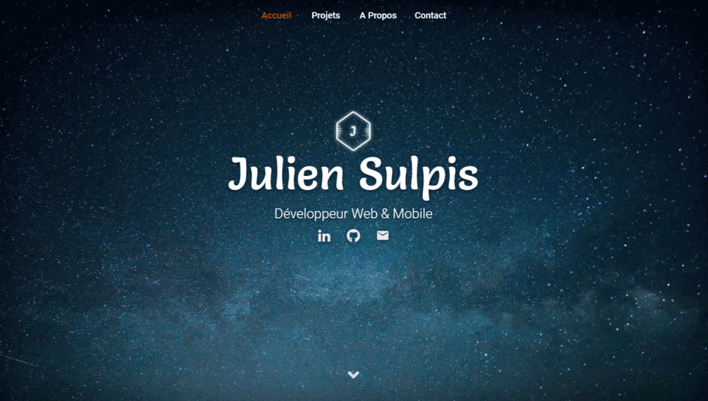

<h1 align="center">Personal Website</h1>

<h3 align="center">The source code of my personal website.</h3>

	

  

## Warning

This repository is public to allow you to see the code, and to benefit from free code analysis, CI and deployment tools. But **you cannot run this website locally**. This is to keep my dev environment private :)

## License

Released under the [GPL-3.0](https://github.com/jsulpis/personal-website/blob/master/LICENSE) license.
